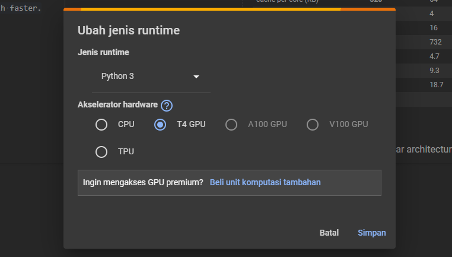

# Recurrent Neural Network (RNN)

Pada Praktikum 2 dan Tugas Praktikum dataset yang digunakan adalah shakespeare.txt. Pemrosesan dataset shakespeare.txt dengan algoritma RNN memerlukan waktu pemrosesan yang lama jika menggunakan runtime hardware CPU pada Google Colab. Alasannya karena sebagai berikut.

1. **Ukuran dataset**: Dataset *shakespeare.txt* memiliki ukuran yang besar, yaitu 1.1 juta karakter. Semakin besar ukuran dataset, semakin lama waktu yang dibutuhkan untuk memprosesnya.

2. **Pemrosesan karakter**: Algoritma RNN memproses dataset karakter per karakter, bukan secara keseluruhan. Oleh karena itu, semakin banyak karakter dalam dataset, semakin lama waktu yang dibutuhkan untuk memprosesnya.

---

Untuk mengatasi waktu pemrosesan yang lama tersebut dapat diatasi dengan mengubah runtime hardware ke T4 GPU.

Alasan GPU lebih baik pada pemrosesan dataset yang besar, yaitu:

1. *Pemrosesan paralel*: GPU dapat memproses ribuan perhitungan secara bersamaan, yang memungkinkannya menangani data dalam jumlah besar dengan cepat dan efisien.

2. *Bandwidth memori yang tinggi*: GPU memiliki bandwidth memori yang lebih tinggi daripada CPU, yang memungkinkannya mengakses dan memanipulasi data dengan lebih cepat.
